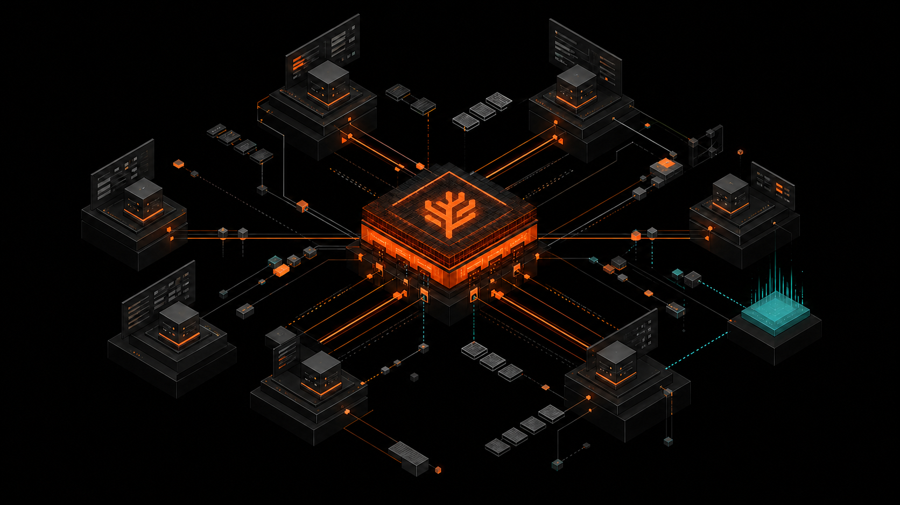
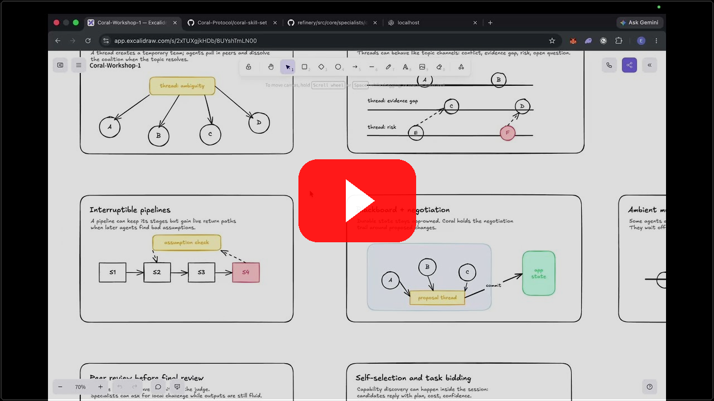

<div align="center">
  

  <h1>Coral Agent Skills</h1>

  <p>
    One installable Coral Protocol skill for building agent systems inside real applications,
    then running and inspecting them through Coral Server or Coral Cloud.
  </p>

  <p>
    <a href="https://github.com/Coral-Protocol/coral-server">Coral Server</a>
    ·
    <a href="https://docs.coralos.ai">Docs</a>
    ·
    <a href="https://youtu.be/_nqTKUwlkio?si=dInXXDaui_-rD1yv">Demo Video</a>
  </p>

  <p>
    <strong><a href="https://coralcloud.ai">Sign up for Coral Cloud</a></strong>
    and receive $30 in LLM proxy credits.
  </p>

  <a href="https://youtu.be/_nqTKUwlkio?si=dInXXDaui_-rD1yv">
    
  </a>
</div>

`coral-skills` gives Codex and other coding agents a single entrypoint for Coral
work. It can now take an application requirement through agent-role design,
graph topology, Koog or existing-agent integration, Puppet/API ingress,
custom-tool callbacks, session lifecycle code, and runtime verification. It
still routes operational questions to the smallest relevant reference and uses
the target runtime's machine-readable schema as the source of truth.

## Build An Agent System

Point Codex at an application repository and ask for the outcome directly:

```text
$coral-skills Build a Coral agent system for this application. Users ask a
question, specialists collaborate in an open graph, and the app stores one
approved structured answer. Implement the first working slice and show me the
real session threads.
```

The skill guides Codex to:

- distinguish role prompts from genuinely separate agent implementations;
- compile user and product signals into a deterministic, testable graph specification;
- preserve application ownership of users, permissions, artifacts, and durable state;
- use Coral groups, threads, mentions, and Puppet/API ingress for real collaboration;
- wire least-privilege custom tools for application reads, writes, and result callbacks;
- build payloads from the live Coral schema instead of remembered request shapes;
- verify registry resolution, connected agents, real messages, results, failures, and session cleanup.

## Install For Claude Code

```text
/plugin marketplace add Coral-Protocol/coral-skill-set
```

```text
/plugin install coral-skills@coral-skill-set
```

```text
/reload-plugins
```

## Install For Codex

```bash
codex plugin marketplace add Coral-Protocol/coral-skill-set
codex plugin add coral-skills@coral-skill-set
```

Confirm installation:

```bash
codex plugin list --marketplace coral-skill-set
```

## Skill

| Invocation | Description |
|---|---|
| `/coral-skills` in Claude Code, `$coral-skills` in Codex | Build and operate Coral agent systems, or route a focused Coral task to the minimal runtime, integration, Cloud, custom-tool, or topology guidance. |

## Reference Routing

The public skill is a strict router. It loads one primary reference by default
and adds a second only when the request crosses boundaries, such as Cloud plus
custom tools or app integration plus session control.

| Reference | Used for |
|---|---|
| [`build-application-agent-system.md`](plugins/coral-skills/skills/coral-skills/references/build-application-agent-system.md) | Turning an application requirement into agents, graph topology, conductor code, app callbacks, and runtime proof. |
| [`coral-setup.md`](plugins/coral-skills/skills/coral-skills/references/coral-setup.md) | Installing, starting, stopping, inspecting, configuring, or troubleshooting Coral Server. |
| [`coral-runtime-reference.md`](plugins/coral-skills/skills/coral-skills/references/coral-runtime-reference.md) | Finding the current machine-readable Coral API, OpenAPI schema, endpoint shapes, manifests, and source fallback. |
| [`coralize-your-agent.md`](plugins/coral-skills/skills/coral-skills/references/coralize-your-agent.md) | Connecting developer-owned agents through Coralizer, `.coral`, `~/.coral`, `coral-agent.toml`, or config-file registry discovery. |
| [`coral-built-in-agent-setup.md`](plugins/coral-skills/skills/coral-skills/references/coral-built-in-agent-setup.md) | Installing and verifying the packaged example agent templates. |
| [`coral-session-control.md`](plugins/coral-skills/skills/coral-skills/references/coral-session-control.md) | Creating, polling, messaging, watching, inspecting, and closing concrete Coral sessions. |
| [`coral-app-integration.md`](plugins/coral-skills/skills/coral-skills/references/coral-app-integration.md) | Wiring Coral into an application while keeping runtime/session coordination separate from durable app state. |
| [`cloud-runtime.md`](plugins/coral-skills/skills/coral-skills/references/cloud-runtime.md) | Coral Cloud API keys, marketplace agents, Cloud Console payloads, LLM proxy, billing, and hosted-runtime boundaries. |
| [`custom-tools.md`](plugins/coral-skills/skills/coral-skills/references/custom-tools.md) | App callbacks, `customTools`, `customToolAccess`, `APP_BASE_URL`, application IDs, secrets, and signature verification. |
| [`setup-patterns.md`](plugins/coral-skills/skills/coral-skills/references/setup-patterns.md) | Session ownership, conductor services, self-hosted deployments, and orchestration patterns. |
| [`coral-coordination-topologies.md`](plugins/coral-skills/skills/coral-skills/references/coral-coordination-topologies.md) | Choosing or reviewing multi-agent communication structures in Coral terms. |
| [`topologies.md`](plugins/coral-skills/skills/coral-skills/references/topologies.md) | Supporting vocabulary for common and niche multi-agent coordination topologies. |

## Getting Started

1. Install the plugin for Claude Code or Codex.
2. Invoke `/coral-skills` in Claude Code or `$coral-skills` in Codex.
3. Ask for the product outcome directly: build an application agent system,
   start a server, inspect a schema, coralize an agent, wire a Cloud custom-tool
   callback, operate a session, or reason about a coordination topology.
4. When exact API calls matter, the skill should fetch the current
   `BASE_URL/api_v1.json` or use the most relevant source fallback.

For Cloud Console exports or marketplace agents, the skill routes agents to the
Cloud runtime and custom-tool callback checklists without copying the full Cloud
API schema into the skillset.

## Prerequisites

- Claude Code or Codex.
- Node.js/npm for `npx coralos-dev@latest` and Coralizer workflows.
- Optional agent CLIs only when installing matching example templates.
- Coral Cloud credentials only when the user is working with Cloud-specific
  sessions, marketplace agents, billing, LLM proxy, or custom-tool callbacks.

## License

MIT
