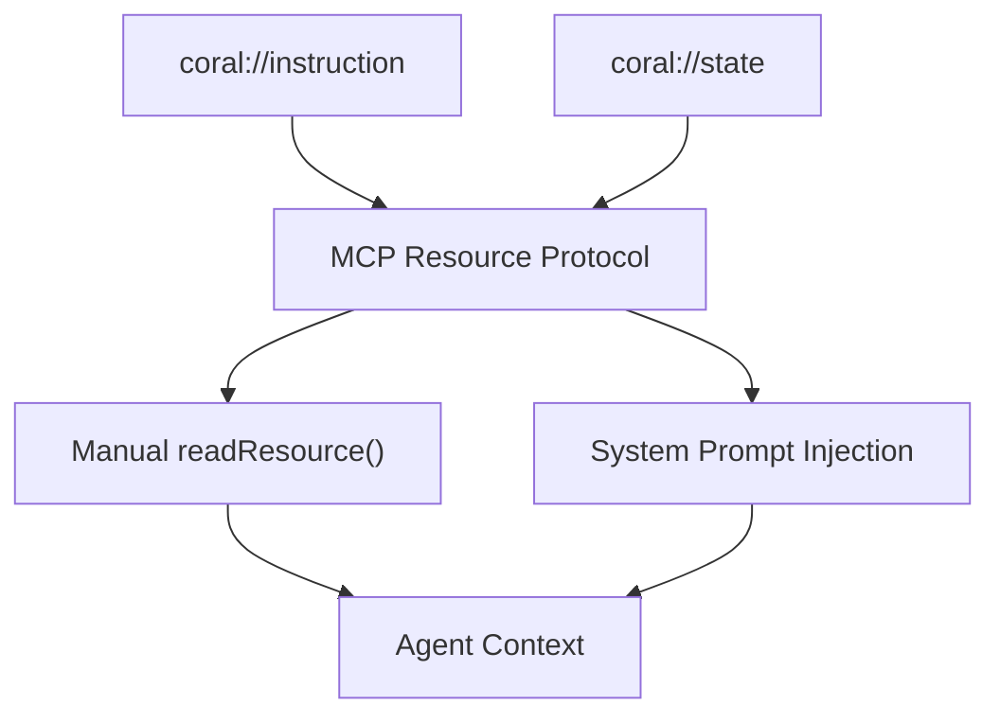

Coral Server exposes two MCP [resources](https://modelcontextprotocol.io/docs/concepts/resources) to every agent in a session. You can think of resources as briefing documents that tell the agent what tools are available, who else is in the session, and what's happened so far. Both are dynamic: their content updates as the session evolves.
In most cases, we recommend injecting both resources into the agent's system prompt. Manual `readResource` calls are still useful, but mainly when your runtime needs programmatic access to the resource contents.
## The Two Resources
| Resource URI            | What it provides                                                   | Format                     |
|:------------------------|:-------------------------------------------------------------------|:---------------------------|
| `coral://instruction`   | How to use Coral's tools and messaging patterns                    | Markdown                   |
| `coral://state`         | The agent's visible slice of the session: other agents, threads, and messages   | Markdown with embedded JSON |
### Instructions (`coral://instruction`)
The instruction resource is dynamically compiled from **snippets**, short markdown sections that explain specific capabilities. Snippets are tied to tools: when an agent has access to a tool, the corresponding instructions are automatically included.
Agents with different tool sets get different instructions. An agent without wait tools won't see documentation about waiting.
### Instruction snippet categories
| Snippet      | Included when                    | Covers                                                                                           |
|:-------------|:---------------------------------|:-------------------------------------------------------------------------------------------------|
| `BASE`       | Always                           | What Coral is, that messaging tools are the only way to communicate with other agents             |
| `MESSAGING`  | Agent has thread/message tools    | Thread lifecycle, participants, sending messages                                                  |
| `MENTIONS`   | Agent can send mentioned messages or wait on mentions | How @‑mentions work and when to use them                                    |
| `WAITING`    | Agent has any wait tool           | The three wait tools (`wait_for_message`, `wait_for_agent`, `wait_for_mention`) and their behaviour |
> **Note:** 
  Instructions are assembled at read time. If a tool is added to an agent mid‑session via a plugin, the corresponding instructions appear on the next read.
### State (`coral://state`)
The state resource renders the session from this agent's perspective. It is rebuilt on every read, so it always reflects the current moment.
It always includes a general section, and may additionally include agent and thread sections when there is visible data:
- **General:** The agent's own name and the current timestamp.
- **Agents:** A JSON array of linked agents with fields like `agentName`, `agentDescription`, `agentConnected`, `agentWaiting`, `agentRunning`, and `agentStartTime`.
- **Threads:** A JSON array of threads the agent participates in, including each thread's name, participants, open/closed state, and either message history or a closure summary.
### Example state resource output
````markdown
# General
You are an agent named researcher. The current UNIX time is 1749484800000 (ISO-8601: 2025-06-09T16:00:00Z).
# Agents
You collaborate with 1 other agents, described below:
Consider that they have different contexts and instructions and don't necessarily know what you know unless you tell them.
```json
[{
  "agentName": "writer",
  "agentDescription": "Drafts and edits content",
  "agentConnected": true,
  "agentWaiting": false,
  "agentSleeping": false,
  "agentRunning": true,
  "agentStartTime": "2025-06-09T15:58:00Z"
}]
```
# Threads and messages
You have access to the following threads and their messages:
```json
[{
  "threadId": "t-001",
  "threadName": "research-findings",
  "owningAgentName": "researcher",
  "participatingAgents": ["researcher", "writer"],
  "state": "open",
  "messages": [{
    "messageText": "Here are the key findings from the analysis.",
    "sendingAgentName": "researcher",
    "messageTimestamp": "2025-06-09T15:59:30Z",
    "mentionAgentNames": ["writer"]
  }]
}]
```
````
> **Info:** 
  State is scoped to the reading agent. An agent only sees threads it participates in and agents it is linked to, never the full session.
## How Resources Reach the Agent
Resources are served via the standard MCP resource protocol, so any MCP client can read them directly. Coral also supports **system prompt injection**, so the agent doesn't need to fetch resources itself.

### System prompt injection
This is the recommended approach. Rather than reading resources in code, you can embed resource placeholders directly in your agent's system prompt. At runtime, the placeholders are resolved and replaced with the actual resource content before the LLM sees the prompt.
This is how our reference agents work. A simple example from the template agent looks like this:
```python
SYSTEM_PROMPT_TEMPLATE = """{custom_prompt}
-- Start of messages and status --
<resource>coral://instruction</resource>
<resource>coral://state</resource>
-- End of messages and status --
"""
```
Each `<resource>` tag is replaced with the current content of that resource. In Coral's reference runtimes, resources are re-resolved each loop iteration, so the agent sees new threads, messages, and agent status changes as they happen.
How this works depends on your runtime:
- **Prototype runtime:** The default system prompt already includes both resource placeholders, and Coral resolves them automatically at runtime. See [Prototype Runtime](/reference/agent/tables/runtimes/prototype) for configuration.
- **Custom runtimes:** You handle injection in the way that fits your framework. In Kotlin our reference agents use `injectedWithMcpResources()`. In Rust they use `CompletionEvaluatedPrompt::all_resources()`.
### Reading resources manually
Any agent connected via MCP can call `readResource` at any time. This is useful when your runtime needs programmatic access to the resource contents instead of prompt-level injection.
```python
instructions = mcp_client.read_resource("coral://instruction")
state = mcp_client.read_resource("coral://state")
```
> **Note:** 
  The resource URIs are also available as environment variables (`CORAL_STATE_RESOURCE_URI`, `CORAL_INSTRUCTION_RESOURCE_URI`) for agents that need to resolve them dynamically. See [PotentialStringReference](/reference/agent/types/potential-string-reference) for details.
## What's Coming: Proxy‑Level Injection
Coral Server includes an LLM proxy that agents can route their API calls through for credential management and token tracking. A planned enhancement will have the proxy automatically inject resource content into LLM requests. This would remove the need to read resources or template system prompts entirely.
> **Info:** 
  Proxy‑level injection is not yet available. For now, use manual `readResource` calls or system prompt injection as described above.
