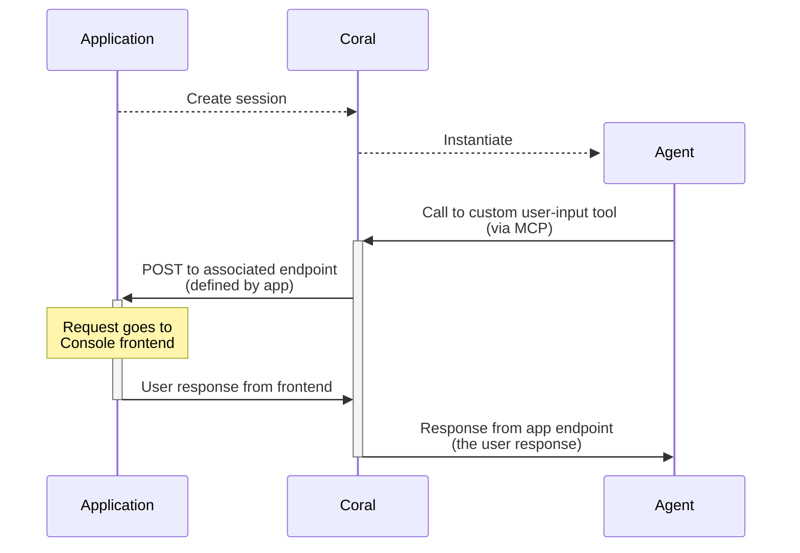

> **Note:** 
See also [this guide](/guides/production/running-in-production) on deploying Coral Server in production
In production, you should only interface with Coral Server is through the [HTTP API](/api-reference/) (not Coral Console).
> **Tip:** Coral Server also serves a dedicated API reference at `/ui/docs`. The OpenAPI schema is also available at `/api_v1.json`.
## Creating Sessions
The create session endpoint is one of the most important endpoints - it's how you define and instantiate graphs of agents.
While [Coral Console](/concepts/coral-console) has a ready-made interface over this endpoint, when integrating Coral with your application - you'll want to use this API directly.
> **Tip:** You can use the JSON available in [Coral Console's](/concepts/coral-console) editor pane when editing a session template - to quickly get a usable request body for your own POST to [`/api/v1/local/session`](/api-reference/local/create-session).
## Custom Tools
There are a lot of scenarios where agents need to be given capabilities that are tightly integrated with your application. While you can hard code these kinds of tools in agents you write yourself, when using agents from other developers - this doesn't work.
For this reason, Coral Server supports passing custom MCP tools to agents at runtime.
When an agent calls one of these custom tools, Coral Server sends a request to an endpoint you provide, to know how to respond.
### Example - User Input
A common use case in applications is exposing some kind of "chat"-style agent to your end users. This can be implemented using custom tools.
You'll typically implement two tools: one to allow the agent to request input from the user, and one for your application to provide the user's response.
As an example, the flow for a user‑input custom tool looks (roughly) like:

